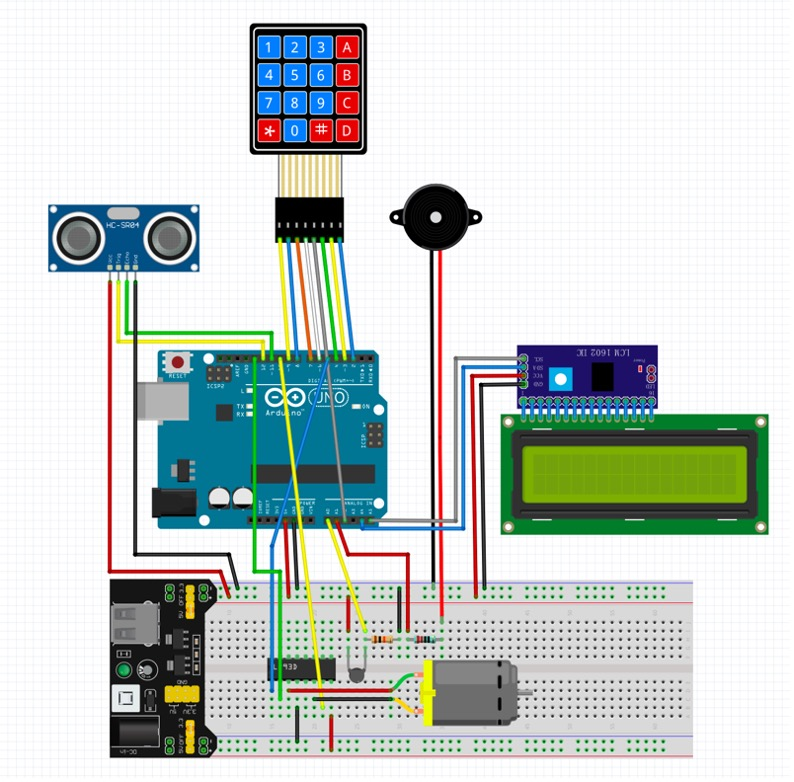

# 卓上アシスタント

**卓上アシスタント**は机の上に置かれ、様々な機能を提供するアシスタントで、大学3年の「センサと制御」という実験の成果物です。

## 機能

* **キーパットA**: 室温を表示する
* **キーパットB**: 超音波距離センサの距離(=机に座っている人との距離)を表示する
* **キーパットC**: 室温(もしくは距離)を非表示する
* **キーパットD**: ファンのモードを変更する
  * **モード0~3**: オフ・弱・中・強
  * **モードA**: 自動
    * 距離が設定値(デフォルト:100cm)未満かつ温度が設定値(デフォルト:29.0℃)以上のとき、ファンがオンになる
* **キーパット#**: 設定モード
* **キーパット0~9**: 演奏機能
  * 押すと、対応する音が鳴ります
* **タイマー機能**
  * ユーザーが机に座っている時間が表示されます
  * 時間が指定値(デフォルト:60分)を超えると、休息を促す音が流れます。
* **表情**
  * LCDにアシスタントの表情が表示されます
    * 嬉しい: 普段の表情
    * 疲れた: ファンが3分以上動いたとき
    * 疑問: キーパッドから指令を受けたとき
    * 無表情: 最初に休憩を促すとき
    * 怒る: 一回促しても使用者が休んでいないとき

## デモ動画

https://user-images.githubusercontent.com/64412588/223047967-a1961d5a-efad-4374-86d7-364662c0ab34.mp4

## 回路図

### 使用した部品

* Arduino Uno R3
* ブレッドボード
* LCDモジュール
* 電源供給モジュール
* 超音波距離センサ
* DCモータ
* モータドライバL293D
* パッシブブザー
* サーミスタ
* キーパッド(Membrane Switch Module)
* 220Ω抵抗
* 10kΩ抵抗
